# Procesverslag
Markdown is een simpele manier om HTML te schrijven.  
Markdown cheat cheet: [Hulp bij het schrijven van Markdown](https://github.com/adam-p/markdown-here/wiki/Markdown-Cheatsheet).

Nb. De standaardstructuur en de spartaanse opmaak van de README.md zijn helemaal prima. Het gaat om de inhoud van je procesverslag. Besteedt de tijd voor pracht en praal aan je website.

Nb. Door *open* toe te voegen aan een *details* element kun je deze standaard open zetten. Fijn om dat steeds voor de relevante stuk(ken) te doen.

## Jij

  
uitwerken voor kick-off werkgroep

  ### Auteur:
  Niels Aling

  #### Je startniveau:
  Blauw of rood 

  #### Je focus:
  Ik wil de focus leggen op responsive design
 

## Je website

  
uitwerken voor kick-off werkgroep

  ### Je opdracht:
  http://www.apple.com

  #### Screenshot(s) van de eerste pagina (small screen): 
  Airpods  
  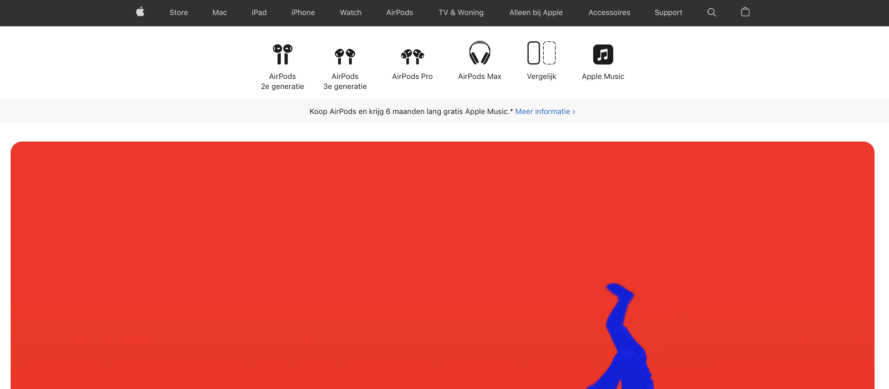
  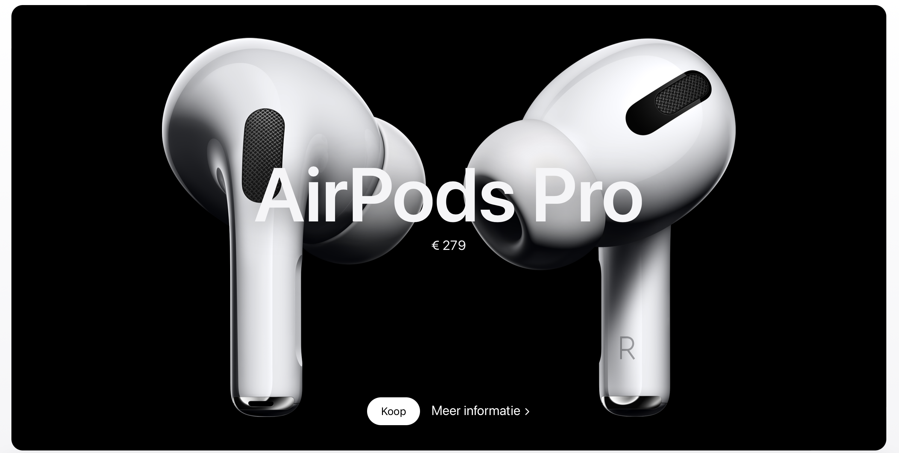

  #### Screenshot(s) van de tweede pagina (small screen):
  Accessories  
  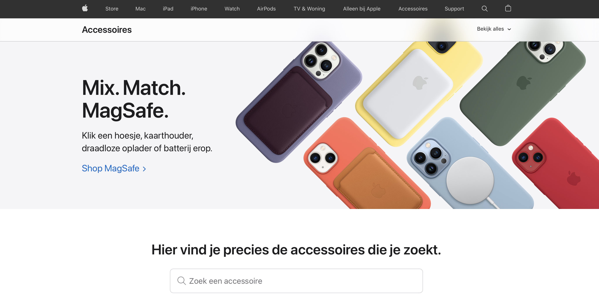
  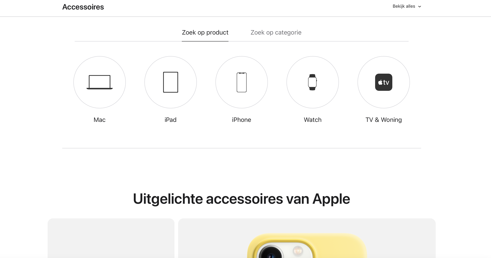
 

## Toegankelijkheidstest 1/2 (week 1)

  
uitwerken na test in 1e werkgroep

  ### Bevindingen
  Lijst met je bevindingen die in de test naar voren kwamen:

  #### Screenreader
  <!-- Hier korte omschrijving (met indien nodig afbeeldingen) -->
  Van een screenreader op apple wordt het daadwerkelijk helemaal gek. Het is super onduidelijk wat je moet doen. De muis geeft niet aan waar je op staat en hij leest continu mijn menubalk voor, niet de website.

  <!-- Hier een omschrijving van hoe het opgelost kan worden (met indien nodig afbeeldingen) -->
  Ik weet niet hoe dit werkt, maar dit moet beter gemaakt worden.

  #### Muis en Toetsenbord 
  <!-- Hier korte omschrijving (met indien nodig afbeeldingen) -->
  De website is niet goed "tab-baar". Hij schokt door de website heen en je moet op meerdere knoppen (ctrl, option shift) klikken om iets te kunnen selecteren. 

 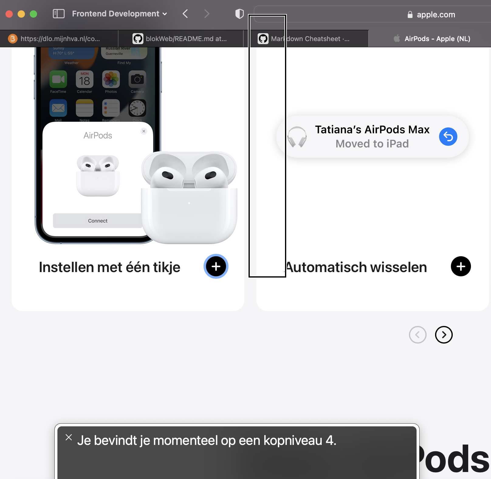

  <!-- Hier een omschrijving van hoe het opgelost kan worden (met indien nodig afbeeldingen) -->

  #### Motoriek (shocks, elastiekjes)
  <!-- Hier korte omschrijving (met indien nodig afbeeldingen) -->
  besturen met shocks is nog redelijk te doen. De knoppen zijn groot genoeg om ze aan te kunnen klikken. Typen daarin tegen is lastiger.
  
  <video controls width="250">
    <source src="readme-images/motoriektest2.mp4"
            type="video/mp4">
</video>

  <!-- Hier een omschrijving van hoe het opgelost kan worden (met indien nodig afbeeldingen) -->

  #### Visueel (brillen, contrast, kleurenblind, dark/light). 
  <!-- Hier korte omschrijving (met indien nodig afbeeldingen) -->
  1.  Met de Blur/Glate bril kun je bijna niks lezen op de website. Je ziet wel wat vlakken en alleen de grote titels met contrast. 

  2. de website heeft geen dark/light mode
  3. kleurenblindheid:
  - Protanopia is goed zichtbaar
  - Deuteranopia is praktisch het zelfde als Protanopia
  - Tritanopia ziet er eigenlijk veel gezelliger uit, contrast is nog steeds duidelijk.
  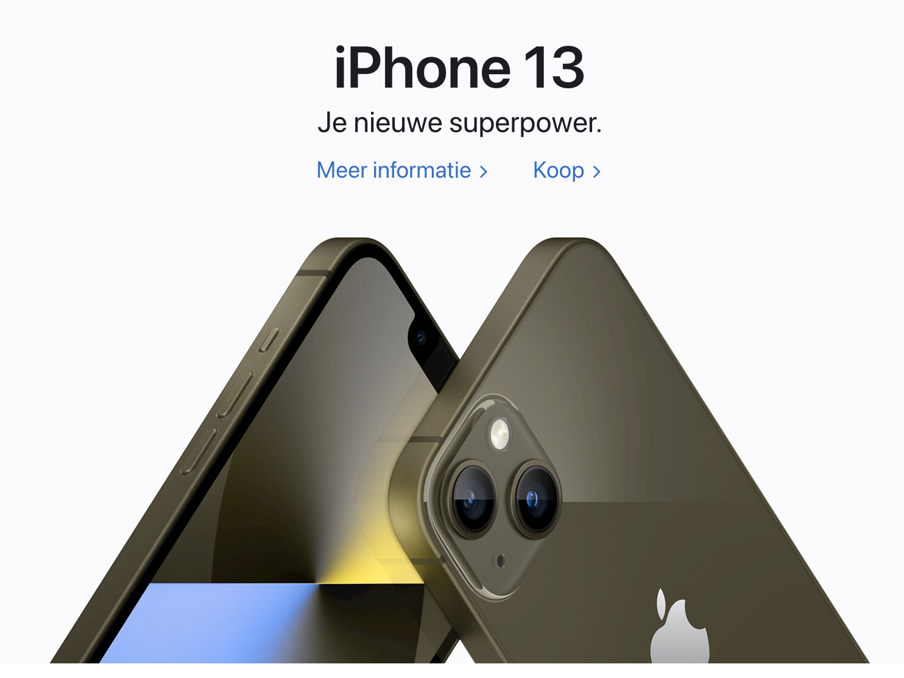

  - Ook met achromatopsia (grijs) is er nog steeds een duidelijk contrast, alleen sommiige foto's en video's zijn iets minder duidelijk zichbaar. 
  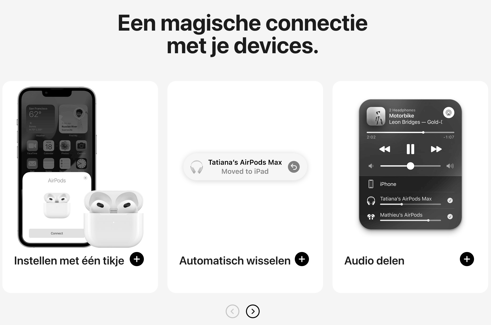

  <!-- Hier een omschrijving van hoe het opgelost kan worden (met indien nodig afbeeldingen) -->
  1. Wanneer je "forced colors" aan zet zie je wel iets meer, dus het zou opgelost kunnen worden met fellere kleuren, grotere letters en meer contrast.
  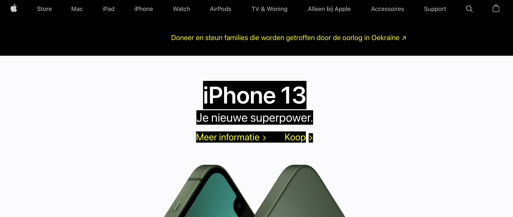

  2. Er kan een dark/light mode gemaakt worden.
  3. De video's en foto's zouden een groter contrast functie of uberhaupt meer contrast moeten krijgen.
  

## Breakdownschets (week 1)

  
uitwerken na afloop 2e werkgroep

  ### de hele pagina: 
  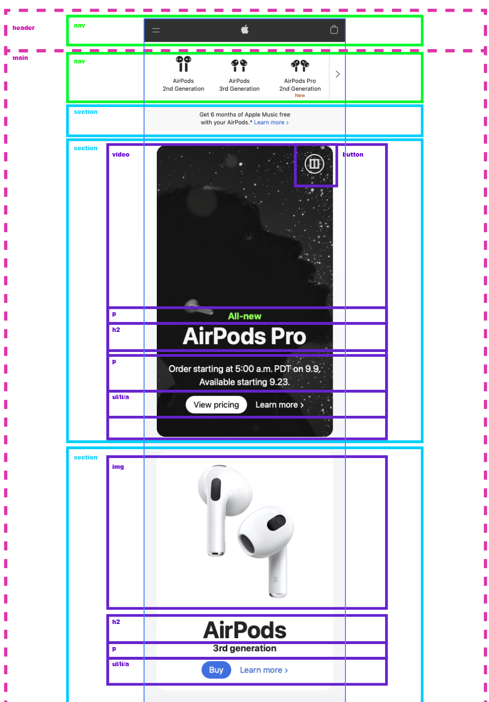

  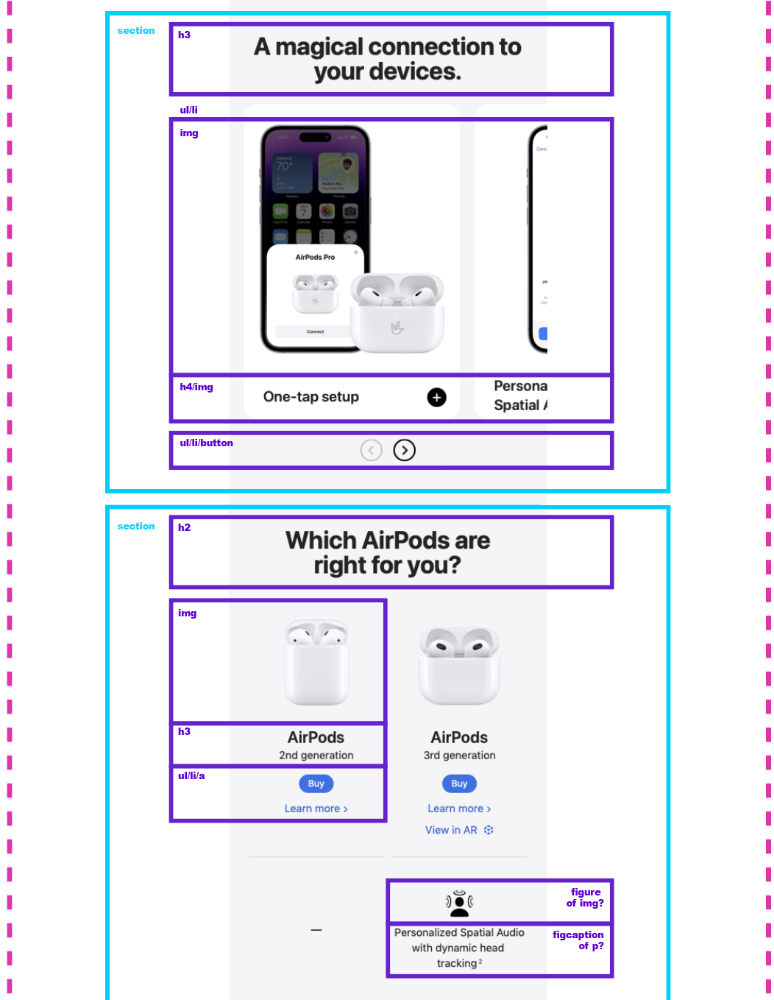

  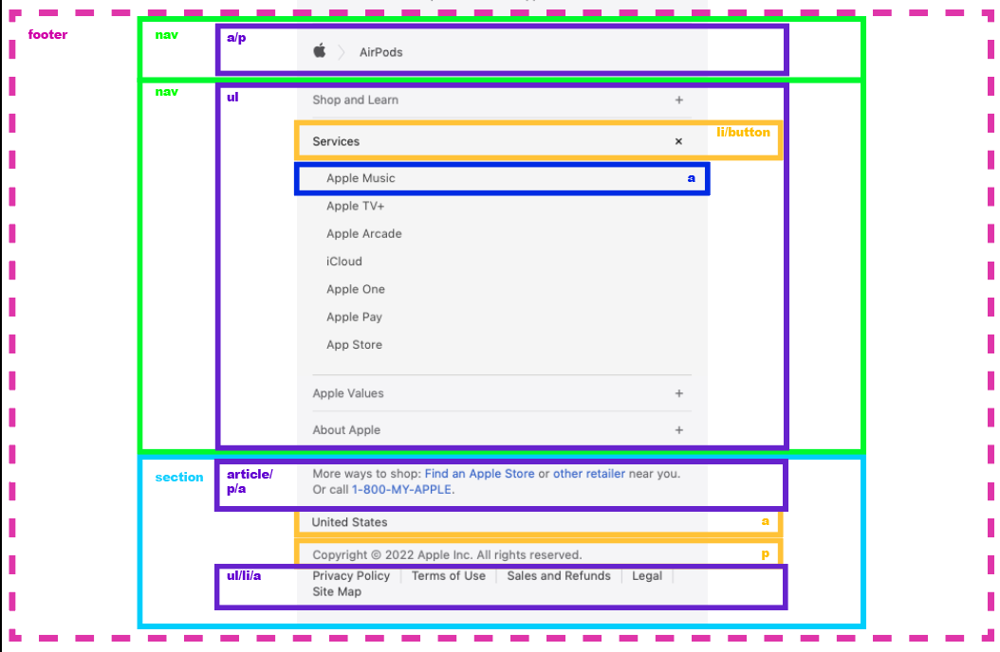

  ### dynamisch deel (bijv menu): 
  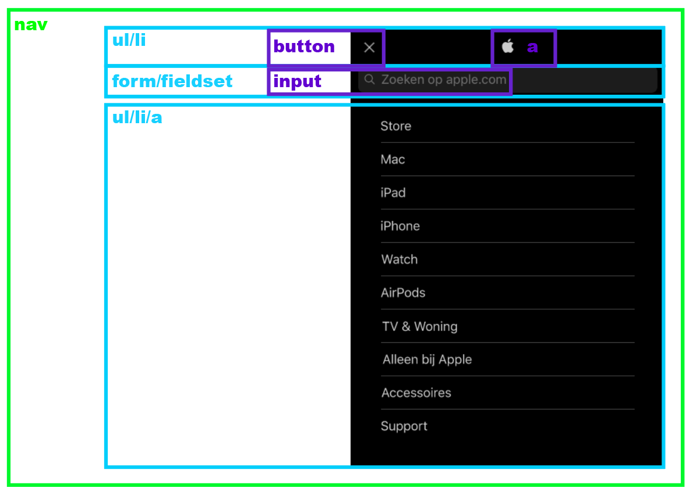

  ### wellicht nog een dynamisch deel (bijv filter): 
  

## Mini Symposium (week 2)

  
Aantekeningen Mini Symposium

  
  Websites voor accesability check
  - https://webaim.org
  - https://www.htmhell.dev

  ### Testen met "Tab" en "Enter"
  - Kun je overal komen met tab
  - Let op focus styling (kan je zien waar je bent)
  - Kun je snel door content heen "tabben"

  Elementen die kunnen helpen bij Tab/Enter:
  - Gebruik "skip link" tussen content in
  - geef de focus styling een duidelijke kleur

  ### Testen met een screen reader.
  - Is alles wat gezegd wordt logisch 
  - Hebben alle elementen een placeholder 
  - Is alles semantisch correct in de HTML
  - Check links met dubbele namen 
  - De volgorde in de html moet kloppen 

  Elementen die kunnen helpen bij screenreaders:
  - Button role geeft waarde aan een knop 
  - Geef Iframes een title 
  - Span in een link zetten zodat de screen reader dat leest 
  - Zet headings boven plaatjes en pas aan met css.
  - remove bullitpoints waar nodig.

  ###  Samenvatting Manuel:
  Om je website gemakkelijk al veel toegankelijker te maken kun je meteen in de HTML al 
  een aantal aapassingen doen. Let op dat je semantisch correcte HTML schrijft. 
  Test vroeg op tab/enter en met een screenreader. 

  ###  Samenvatting Eric:
  Toegankelijkheid zit hem in de kleinste dingen. Soms heb je niet eens door dat je iets
  ontwerpt dat voor veel mensen niet toegankelijk is. Bijvoorbeeld de collegezaal waar we
  in zaten. Het helpt om goed met mensen met een beperking te praten om te kijken naar de behoeften
  van de persoon in plaats van uitgaan van aannamens en daar je ontwerp op baseren. 
  Onderzoek is key. 

## Voortgang 1 (week 2)

  
uitwerken voor 1e voortgang

  ### Stand van zaken
  hier dit ging goed & dit was lastig (neem ook screenshots op van delen van je website en code)

  Over het algemeen ging het maken van de html best wel vloeiend. 
  Dit kwam grotendeels door van te voren een breakdown schets te maken. Daarnaast heb ik de website van Apple geinspecteerd in Google om te kijken hoe zij dat deden en of ik dat logisch vond. 
  Ik probeerde hierbij divjes en spans te vermijden en zelf een logische structuur op te zetten.

  
  
  
  
  

  ### Verslag van meeting
  hier na afloop snel de uitkomsten van de meeting vastleggen

  - Opzoeken hoe een tabel werkt
  - Op bepaalde plekken kunnen elementen nog in een article 
  - Footer heeft 2 sections ipv een footer in de main
  - Kijken naar andere opties dan ul
  - summary element W3Schools voor uitklapbare elementen 

## Voortgang 2 (week 3)

  
uitwerken voor 2e voortgang

  ### Stand van zaken
  hier dit ging goed & dit was lastig (neem ook screenshots op van delen van je website en code)

  ### Agenda voor meeting
  samen met je groepje opstellen

  | student 1      | student 2          | student 3    | student 4        |
  | ---            | ---                | ---          | ---              |
  | dit bespreken  | en dit             | en ik dit    | en dan ik dat    |
  | en dat ook nog | dit als er tijd is | nog een punt | dit wil ik zeker |
  | ...            | ...                | ...          | ...              |

  ### Verslag van meeting
  hier na afloop snel de uitkomsten van de meeting vastleggen

  - punt 1
  - punt 2
  - nog een punt
- ...

## Toegankelijkheidstest 2/2 (week 4)

  
uitwerken na test in 8e werkgroep

  ### Bevindingen
  Lijst met je bevindingen die in de test naar voren kwamen (geef ook aan wat er verbeterd is):

  #### Screenreader
  Hier korte omschrijving (met indien nodig afbeeldingen)

  Hier een omschrijving van hoe het opgelost kan worden (met indien nodig afbeeldingen)

  #### Muis en Toetsenbord 
  Hier korte omschrijving (met indien nodig afbeeldingen)

  Hier een omschrijving van hoe het opgelost kan worden (met indien nodig afbeeldingen)

  #### Motoriek (shocks, elastiekjes)
  Hier korte omschrijving (met indien nodig afbeeldingen)

  Hier een omschrijving van hoe het opgelost kan worden (met indien nodig afbeeldingen)

  #### Visueel (brillen, contrast, kleurenblind, dark/light). 
  Hier korte omschrijving (met indien nodig afbeeldingen)

  Hier een omschrijving van hoe het opgelost kan worden (met indien nodig afbeeldingen)

## Voortgang 3 (week 4)

  
uitwerken voor 3e voortgang

  ### Stand van zaken
  hier dit ging goed & dit was lastig (neem ook screenshots op van delen van je website en code)

  ### Agenda voor meeting
  samen met je groepje opstellen

  | student 1      | student 2          | student 3    | student 4        |
  | ---            | ---                | ---          | ---              |
  | dit bespreken  | en dit             | en ik dit    | en dan ik dat    |
  | en dat ook nog | dit als er tijd is | nog een punt | dit wil ik zeker |
  | ...            | ...                | ...          | ...              |

  ### Verslag van meeting
  hier na afloop snel de uitkomsten van de meeting vastleggen

  - punt 1
  - punt 2
  - nog een punt
  - ...

## Eindgesprek (week 5)

  
uitwerken voor eindgesprek

  ### Je uitkomst - karakteristiek screenshots:
  

  ### Dit ging goed/Heb ik geleerd: 
  Korte omschrijving met plaatjes

  

  ### Dit was lastig/Is niet gelukt:
  Korte omschrijving met plaatjes

  

## Bronnenlijst

  
continu bijhouden terwijl je werkt

  Nb. Wees specifiek ('css-tricks' als bron is bijv. niet specifiek genoeg).

  1. Hoe krijg je Apple's lettertype: 
  https://www.geeksforgeeks.org/how-to-add-apples-new-san-francisco-font-on-a-webpage-using-css/
  
  2. Hoe werkt background image ook al weer:
  https://www.w3schools.com/cssref/pr_background-image.asp

  3. Image extractor:
  https://extract.pics/

  4. details & summary met Robert:
  https://codepen.io/robertspier/pen/NWMapEM

  5. uitklapbaar menu met Robert:
  https://codepen.io/robertspier/pen/PoeJpVO

  6. How to full screen mobile menu:
  https://www.w3schools.com/howto/tryit.asp?filename=tryhow_js_overlay

  7. search bar maken:
  https://developer.mozilla.org/en-US/docs/Web/HTML/Element/input

  8. Background Image centreren:
  https://www.w3schools.com/cssref/pr_background-position.asp

  

